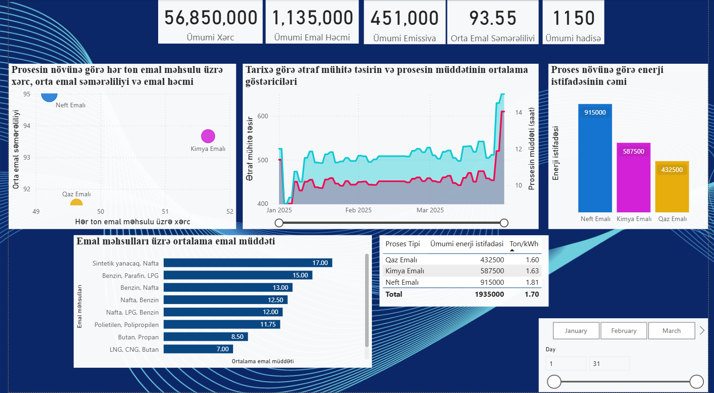
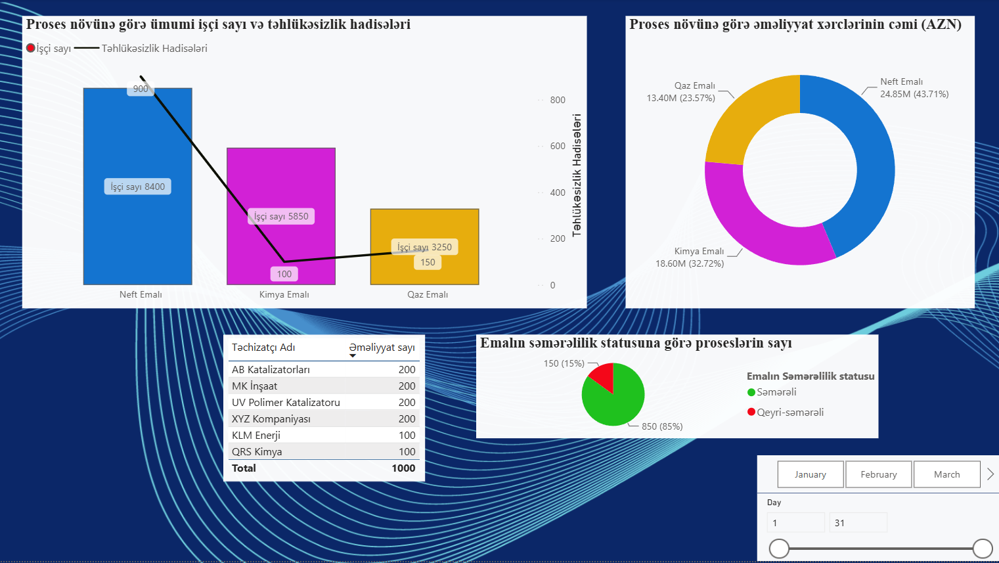
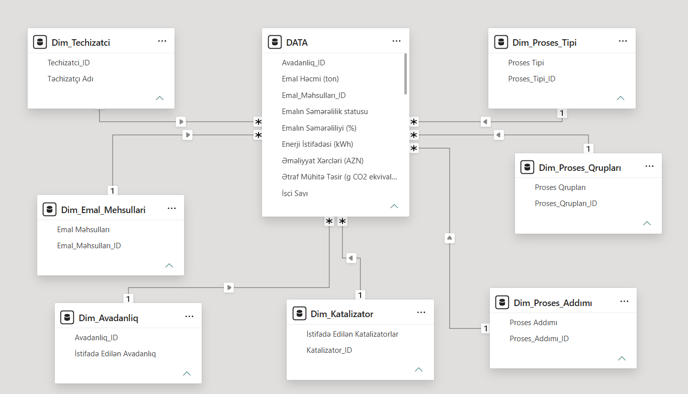

# Refinery Process Performance Analysis

**Industrial operations analytics project built in Power BI to evaluate process efficiency, energy consumption, operating costs, emissions, processing time, workforce exposure, and safety performance across refinery operations.**

The project transforms operational data into a structured analytical model and uses it to identify where efficiency improvements, cost control, energy optimization, and safety interventions could have the greatest impact.

---

## Project Overview

Industrial operations cannot be evaluated effectively through a single KPI.

A process may appear productive while simultaneously consuming excessive energy, generating higher operating costs, creating greater environmental impact, or showing elevated safety exposure.

This project was built to analyze those dimensions together and answer a broader question:

> **Which operational areas should receive the highest management attention, and why?**

The analysis follows an end-to-end BI workflow:

**Raw Operational Data → Data Preparation → Dimensional Modeling → KPI Development → Power BI Analysis → Operational Recommendations**

### Tech Stack

**Excel · Power Query · Power BI · DAX · Data Modeling · Business Intelligence · Operational Analytics**

---

## Business Objectives

The analysis focuses on identifying operational performance differences across refinery processes.

Key questions include:

- Which process types consume the most energy?
- Where are operating costs concentrated?
- Which areas show the highest safety exposure?
- How efficiently are refinery processes operating?
- Which process types have longer processing times?
- Where is environmental impact concentrated?
- Which operational areas should be prioritized for optimization?
- Can stronger-performing processes provide practices that could be transferred to weaker areas?

---

# Dashboard

## Operational Performance Overview



The main dashboard provides a consolidated view of refinery operations across several performance dimensions, including:

- process efficiency
- energy consumption
- operating costs
- emissions
- employee levels
- safety incidents
- processing activity

This makes it possible to evaluate operational performance not only from a production perspective, but also from a **cost, risk, safety, and sustainability perspective**.

---

## Process Performance Analysis



The detailed analysis compares major process types and highlights where operational resources and risks are concentrated.

The dashboard supports comparison of:

- Oil Refining
- Chemical Processing
- Gas Processing

across energy, cost, safety, efficiency, and environmental indicators.

---

# Data Architecture

Rather than analyzing one flat spreadsheet directly, the data was organized into a **fact-and-dimension analytical model**.



The central fact table contains operational measurements, while supporting dimension tables provide descriptive context for the analysis.

### Dimension Structure

The model includes dimensions for:

- Equipment
- Process Type
- Process Step
- Process Group
- Catalyst
- Supplier
- Processed Product

This structure allows the same operational metrics to be analyzed from multiple business perspectives without duplicating analytical logic.

---

# Data Preparation

The project contains both the cleaned analytical dataset and the structured model used for Power BI reporting.

### Core Data

[`Clean_data.xlsx`](data/Clean_data.xlsx)

Contains the cleaned operational data prepared for analysis.

[`Fact_table.xlsx`](data/Fact_table.xlsx)

Contains the central operational fact table used in the dimensional model.

### Dimension Tables

- [`Dim_Avadanliq.xlsx`](data/dimensions/Dim_Avadanliq.xlsx)
- [`Dim_Emal_Mehsullari.xlsx`](data/dimensions/Dim_Emal_Mehsullari.xlsx)
- [`Dim_Katalizator.xlsx`](data/dimensions/Dim_Katalizator.xlsx)
- [`Dim_Proses_Addımı.xlsx`](data/dimensions/Dim_Proses_Addımı.xlsx)
- [`Dim_Proses_Qrupları.xlsx`](data/dimensions/Dim_Proses_Qrupları.xlsx)
- [`Dim_Proses_Tipi.xlsx`](data/dimensions/Dim_Proses_Tipi.xlsx)
- [`Dim_Techizatci.xlsx`](data/dimensions/Dim_Techizatci.xlsx)

The separation between fact and dimension tables improves the analytical structure of the model and supports more flexible reporting.

---

# Analytical Focus

The Power BI report evaluates the refinery from several operational perspectives.

### Efficiency

Processes are evaluated according to operational efficiency in order to distinguish stronger-performing operations from areas requiring improvement.

### Energy

Energy consumption is compared across process types to identify where optimization initiatives could produce the largest effect.

### Cost

Operating costs are analyzed to determine which refinery activities contribute most heavily to total operational expenditure.

### Safety

Employee exposure and safety incidents are examined together to identify operational areas requiring stronger monitoring and safety controls.

### Environmental Performance

Emission-related indicators are incorporated into the analysis to evaluate the environmental impact of refinery activity.

### Processing Time

Processing-time indicators are used to identify process areas where production flow or operational execution may require improvement.

---

# Key Findings

## 1. Oil Refining is the Main Operational Pressure Point

Oil Refining consistently emerged as the most resource-intensive process area.

It recorded approximately:

**915,000 kWh of energy consumption**

making it the largest energy consumer among the analyzed process types.

Chemical Processing and Gas Processing recorded lower energy consumption of approximately **587,500 kWh** and **432,500 kWh**, respectively.

This indicates that energy-efficiency initiatives focused on Oil Refining could produce the largest operational impact. 

---

## 2. Operating Costs are Concentrated in Oil Refining

Oil Refining accounted for approximately:

**43.71% of total operating costs**

making it the largest cost contributor among the analyzed process categories.

The result suggests that even relatively small efficiency improvements within this process could have a meaningful effect on overall operating expenditure.

---

## 3. Safety Exposure is Also Highest in Oil Refining

Oil Refining contained approximately:

**8,400 employees**

and recorded around:

**900 safety incidents**

The larger workforce contributes to the absolute number of incidents, so incident count alone should not automatically be interpreted as poorer safety performance.

However, the concentration of both employees and incidents makes Oil Refining a logical priority for deeper safety analysis and stronger preventive controls.

---

## 4. Most Processes are Operating Efficiently

Approximately:

**85% of the analyzed processes were classified as efficient.**

This indicates generally strong operational performance.

However, the remaining **15% of inefficient processes** represent the clearest candidates for root-cause investigation and continuous improvement initiatives.

---

## 5. Energy and Environmental Performance are Connected

Oil Refining showed both higher energy consumption and greater environmental impact than the other major process categories.

This means energy optimization may create a dual benefit:

**lower operational resource consumption + improved environmental performance**

rather than being treated only as a cost-reduction initiative.

---

## 6. Processing Time Indicates Additional Optimization Potential

Longer processing times were observed in Oil Refining operations.

This may indicate opportunities to investigate:

- production flow
- equipment utilization
- process sequencing
- operating conditions
- process bottlenecks

before deciding on specific operational changes.

---

# From Analysis to Operational Action

The value of the project is not limited to reporting KPIs.

The analytical findings were translated into practical areas for management attention.

### Energy Optimization

Prioritize Oil Refining when investigating opportunities to reduce energy consumption.

### Cost Control

Analyze the operational drivers behind the high share of costs generated by Oil Refining.

### Safety Management

Strengthen monitoring and preventive controls in areas with high workforce and incident concentration.

### Process Improvement

Investigate the inefficient 15% of processes and identify the operational characteristics separating them from stronger-performing processes.

### Environmental Monitoring

Evaluate emissions together with energy usage rather than treating sustainability metrics independently from operational performance.

### Best-Practice Transfer

Study stronger-performing Chemical Processing and Gas Processing operations to determine whether their practices can be transferred to less efficient refinery processes.

---

# Power BI Report

The complete interactive Power BI report is available here:

[`refinery_process_analysis.pbix`](powerbi/refinery_process_analysis.pbix)

The report supports analysis across multiple operational dimensions and allows users to move from portfolio-level KPIs to more detailed process-level comparisons.

---

# Analysis Documentation

The detailed interpretation and findings generated from the dashboard are documented separately:

[`analysis_findings.docx`](docs/analysis_findings.docx)

---

# Repository Structure

```text
refinery-process-performance-analysis/
│
├── data/
│   ├── Clean_data.xlsx
│   ├── Fact_table.xlsx
│   │
│   └── dimensions/
│       ├── Dim_Avadanliq.xlsx
│       ├── Dim_Emal_Mehsullari.xlsx
│       ├── Dim_Katalizator.xlsx
│       ├── Dim_Proses_Addımı.xlsx
│       ├── Dim_Proses_Qrupları.xlsx
│       ├── Dim_Proses_Tipi.xlsx
│       └── Dim_Techizatci.xlsx
│
├── powerbi/
│   └── refinery_process_analysis.pbix
│
├── docs/
│   └── analysis_findings.docx
│
├── images/
│   ├── operations_overview.png
│   ├── process_performance.png
│   └── powerbi_data_model.png
│
└── README.md
```

---

# What This Project Demonstrates

This project demonstrates the ability to move from operational data to a structured decision-support solution:

**Data Preparation → Dimensional Modeling → KPI Development → Power BI Reporting → Operational Insight → Management Action**

It combines technical BI skills with business analysis across **efficiency, cost, energy, safety, environmental performance, and process optimization**.
